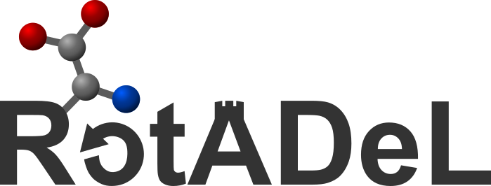

<picture>
  <source media="(prefers-color-scheme: dark)" srcset="docs/images/logo_dark_bg.svg">
  
</picture>


[](https://pypi.org/project/rotadel/)

<!-- TODO: once paper is published, replace this comment with:
[](https://doi.org/<PAPER_DOI>) -->

### **Rot**amer-dependent **A**mino acid **De**scriptors **L**ibrary

---

`rotadel` is a Python package containing a pre-computed database of stereo-electronic descriptors calculated on amino acid rotamers, the code to generate this database, and query functionalities to return feature vectors for the desired amino acid residues.

# Installation

```shell
$ pip install rotadel
```

Generating the descriptor database itself requires additional dependencies — see `environment-dev.yml`.

# Usage

`rotadel` allows to query the pre-computed descriptors for the desired residues, either from a specific structure, or averaged on the whole rotamer ensemble.

The main functionalities are described below. For the full set of options, see the docstrings in [`rotadel/query/query.py`](rotadel/query/query.py). For more detailed explanations, see the associated publication.
<!-- TODO: once paper is published, add link to "publication"-->

## Query closest rotamer

Query the descriptors of the rotamer with minimum side-chain chi-angle distance to a given residue in a PDB file:

```python
>>> from rotadel.query import query_closest
>>> result = query_closest("structure.pdb", pdb_res_num=42)
>>> result["rotamer_id"]     # ID of the closest matching rotamer in the library
>>> result["chis_distance"]  # its angular distance to the target structure
>>> result["chis"]           # its side-chain dihedral angles
>>> result["descriptors"]    # its descriptors
```

The target residue can either be specified by its residue number (`pdb_res_num`) in the PDB file or by its position in the sequence (`res_position`).

### Batch queries over PDB files

For a dataset of PDB files, `get_descriptors_pdbs` queries descriptors for many residues at once (parallelisable with the `num_workers` argument) and returns a Tuple of DataFrames, with one row per PDB structure, containing:
- first DataFrame: descriptors of closest rotamers for each given residue
- second DataFrame: ID, chi angles, and angular distance for each matching closest rotamer

```python
>>> from rotadel.query import get_descriptors_pdbs
>>> descriptors_df, rotamers_df = get_descriptors_pdbs(
        pdb_files=["a.pdb", "b.pdb"],
        structure_labels=["variant_a", "variant_b"],
        pdb_res_nums=[36, 100, 177],
        output_dir="results",
        num_workers=4,
    )
```

If a directory path is provided with `output_dir`, the DataFrames are also saved in that directory in the CSV files `"queries_closest_descriptors.csv"` and `"queries_matching_rotamers.csv"` respectively.

## Query weighted-average

Query the rotamer-probability-weighted average descriptors for a residue, optionally given its sequence neighbouring residues in the amino acid sequence:

```python
>>> from rotadel.query import query_average
>>> descriptors = query_average("Cys")
>>> descriptors = query_average("Cys", left_neighbour="Glu", right_neighbour="Gly")
```

The residue label can be given by its 1-letter or 3-letters amino acid code.

### Batch queries over sequences

For a dataset of amino acid sequences `get_descriptors_sequences` queries descriptors for many residues at once (parallelisable with the `num_workers` argument) and returns a DataFrame, with one row per sequence, containing the averaged descriptors weighted by the rotamer probability for each given residue.

```python
>>> from rotadel.query import get_descriptors_sequences
>>> get_descriptors_sequences(
        sequences=["...EAVPTPIM...", "...EAVPAPIM..."],
        sequence_labels=["variant_a", "variant_b"],
        res_positions=[36, 100, 177],
        output_dir="results",
        num_workers=4,
    )
```

If a directory path is provided with `output_dir`, the DataFrame is also saved in that directory in the CSV file `"queries_average_descriptors.csv"`.

## Specifying charge, pH, or tautomer

The residue charge (and, for histidine, the tautomer "E" or "D") can be given as argument(s) when calling the query functions. Alternatively, the pH can be provided to infer the charge from it. If neither charge nor pH are given, the protonation state of the amino acid at pH=7.4 is taken.

```python
>>> query_average("Glu", charge=-1)
>>> query_average("Glu", pH=4)
>>> query_average("His", tautomer="D")
```

`query_closest` accepts the same `charge`/`tautomer`/`pH` arguments as `query_average`. The batch functions `get_descriptors_pdbs` and `get_descriptors_sequences` take the plural `charges`/`tautomers` (sequence of one value per target residue) instead.

## Listing available descriptors

The function `get_descriptors_names()` from [`rotadel/common/sql.py`](rotadel/common/sql.py) returns the list of all properties available in the `rotadel` database. If `only_mol=True` is given to this function, only the names of the molecular properties (excluding the atomic descriptors) are returned.

## Generate the database

The pipeline to generate the rotamer descriptors database is described in [`rotadel/generation/README.md`](rotadel/generation/README.md).

# How to cite

A manuscript is in preparation:

> Lauriane Jacot-Descombes, Kjell Jorner. *Rotamer-dependent Amino Acid Descriptors as Protein
> Representation for Bioactivity Prediction*. 2026. (in preparation)

In the meantime, please cite this repository — see [`CITATION.cff`](CITATION.cff).

<!-- TODO: Update once paper is published-->

# Data availability

All data to reproduce the study of the associated publication can be found on Zenodo.
<!-- TODO: once paper is published, add link to "Zenodo"-->
